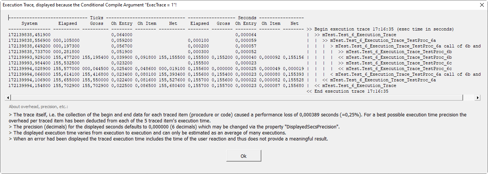

# Trc
Common VBA Component: Execution Trace
See also the post: [Common VBA Execution Trace]()
## Service
Displays a compact

or a very detailed

execution trace which includes all executed procedures which have a BoP/EoP statements or BoC/EoC for an executed part of code.

## Installation
## Usage
## Contribution