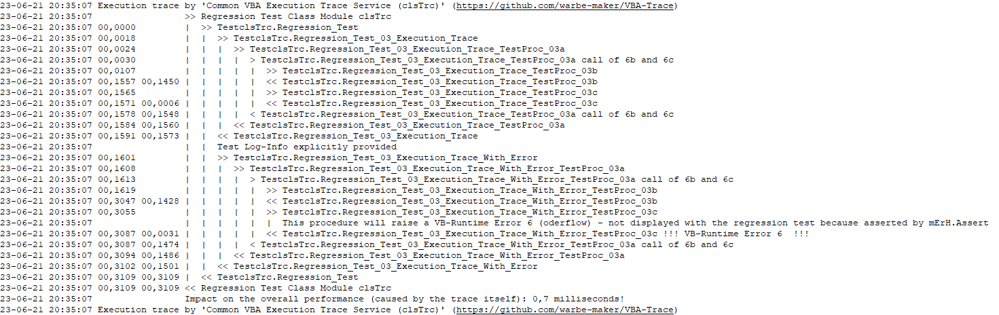

## Common VBA Execution Trace Services

Writes records of traced procedure executions and/or code snippets to a trace-log-file. Thereby supports the identification of performance issues and documents execution in general. The services are available as a Standard Module (`mTrc`) or a Class Module (`clsTrc``). See [Arguments](#arguments-for-either-of-the-two-components) for which one to use.



## Public services

| Service       | <small>Method<br>Property<br>(r/w)</small>| Purpose                                                                 |
|---------------|:-----------:|-------------------------------------------------------------------------|
|`BoC`          | M   | Indicates the **B**egin **o**f a **C**ode sequence to be traced.<br>**Attention:** In order to keep this service optional it is exclusively called via an [BoC Interface](#boceoc-interface) which is to be copied in each component when used.|
|`BoP`          | M   | Indicates the **B**egin **o**f the execution trace of a **P**rocedure.<br>**Please note:** Because this service is also available with the `mErH` component. When both compomnents are installed `mErH` takes precedence. To manage which one is used BoP has to be called via an [BoP Interface](#bopeop-interface) which decides this based on Conditional Compile Arguments.       |
|`Continue`     | M   | May be used when a user interaction has been completed (e.g. by pressed button of a `VBA.MsgBox`) to continue a `Pause`ed execution trace's time taking.|
|`Dsply`        | M   | Displays the content of the trace log file. Available only when the mMsg/fMsg modules are installed and this is indicated by the Conditional Compile Argument `mMsg = 1`. Without mMsg/fMsg the trace result log will be viewed with any appropriate text file viewer. |
|`EoC`          | M   | Indicates the **E**nd **o**f a **C**ode sequence to be traced.<br>**Please note:** In order to keep this service optional it is exclusively called via an [EoC Interface](#boceoc-interface) which is to be copied in each component when used.|
|`EoP`          | M   | Indicates the (E)nd **o**f the execution trace of a **P**rocedure.<br>**Attention:** This service is also available with the `mErH` component. When both components are installed `mErH` takes precedence. To manage which one is used `EoP` has to be called via an [EoP Interface](#bopeop-interface) which decides this based on Conditional Compile Arguments. |
|`Pause`        | M   | May be used when a before a user interaction is requested (e.g. by a `VBA.MsgBox`) to suspend the execution trace's time taking. |
|`FileBaseName` | r/w | String expression, write only, specifies the execution-trace-log-file's base name, defaults to `ExceTrace`. |
|`FileExtension`| r/w | String expression, read/write, specifies the log-file's file extension, defaults to `log`|
|`FileFullName` | r/w | String expression, read/write, write: specifies the full name of the log-file, replaces any defaults (location, base-name, extension; read: returns the joint `FileLocation\FileBaseName.FileExtension`.|
|`FileLocation` | r/w | String expression, read/write, specifies the log-files location, defaults to the `ActiveWorkbook.Path`.|
|`LogInfo`      | w | Adds an entry to the trace log file by considering the current nesting/indentation level. |
|`Title`        | w | String expression, specifies the title written to the trace-log-file at the begin and the end of the execution trace (see example above). |


[^1]: S=Sub/Method, P=Property (w=write/Let, r=read/Get)

## Installation
1. [Download](#download-from-public-github-repo) either [mTrc.bas][4] or [clsTrc.cls][9]
2. Import it to your VB-Project
3. [Activate](#Activation) it through Conditional Compile Argument  
   &nbsp;&nbsp;&nbsp;`mTrc = 1` (when mTrc is installed and is to be used)  
   &nbsp;&nbsp;&nbsp;`clsTrc = 1` (when mTrc is installed and is to be used)  
   Be aware that though both may be installed only one may be used at a time!  
4. Set a _Reference_ to the _Microsoft Scripting Runtime_  
Nothing else needs to be installed. Each of the components works completely autonomous.

## Activation
Writing code which may or may not be possible to be executed depending on whether a module is installed or not is a challenge. The way how this is achieved is through procedures functioning as call interface, whereby only those statements are executed of which the corresponding component is installed **and** activated via Conditional Compile Arguments.

## Usage
The approach allows to have the services called in the code even when the servicing component is not installed or when the service is deactivated because not desired. To achieve this flexibility _Conditional Compile Arguments_ are used with an **interface** dedicated to each **service**. When the corresponding _Conditional Compile Argument_ are missing or set to 0 absolute nothing happens irrespective of an installed [mTrc.bas][4] or [clsTrc.cls][9].

### Service interfaces
> It is **essential** that BoP/EoP and BoC/EoC services are always called **paired** with identical arguments!

#### BoP/EoP interface
```vb
Private Sub BoP(ByVal b_proc As String, ParamArray b_arguments() As Variant)
' ------------------------------------------------------------------------------
' Common 'Begin of Procedure' interface serving the 'Common VBA Error Services'
' and the 'Common VBA Execution Trace Service'. To be copied into any component
' using the BoP service - either through the 'Common VBA Error Services' and/or
' the 'Common VBA Execution Trace Service'.
' ------------------------------------------------------------------------------
    Dim s As String: If Not IsMissing(b_arguments) Then s = Join(b_arguments, ";")
#If mErH = 1 Then
    '~~ The error handling will also hand over to the Common VBA Execution Trace
    '~~ provided one is installed (mTrc/clsTrc) and activated.
    mErH.BoP b_proc, s
#ElseIf clsTrc = 1 Then
    '~~ mErH is not installed but the mTrc is
    Trc.BoP b_proc, s
#ElseIf mTrc = 1 Then
    '~~ mErH neither mTrc is installed but clsTrc is
    mTrc.BoP b_proc, s
#End If
End Sub

Private Sub EoP(ByVal e_proc As String, Optional ByVal e_inf As String = vbNullString)
' ------------------------------------------------------------------------------
' Common 'End of Procedure' interface serving the 'Common VBA Error Services'
' and the 'Common VBA Execution Trace Service'. To be copied into any component
' using the EoP service - either through the 'Common VBA Error Services' and/or
' the 'Common VBA Execution Trace Service'.
' ------------------------------------------------------------------------------
#If mErH = 1 Then
    '~~ The error handling will also hand over to the Common VBA Execution Trace
    '~~ provided one is installed (mTrc/clsTrc) and activated.
    mErH.EoP e_proc
#ElseIf clsTrc = 1 Then
    Trc.EoP e_proc, e_inf
#ElseIf mTrc = 1 Then
    mTrc.EoP e_proc, e_inf
#End If
End Sub
```
#### BoC/EoP interface
While _BoP/EoP_ are services also provided by the [mErH.bas][6] component, these two services are exclusively be provided by the [mTrc.bas][4]/[clsTrc.cls][9] components.
```vb

Private Sub BoC(ByVal b_id As String, ParamArray b_arguments() As Variant)
' ------------------------------------------------------------------------------
' Common '(B)egin-(o)f-(C)ode' interface for the 'Common VBA Execution Trace
' Service'. To be copied into any module using the BoC service.
' ------------------------------------------------------------------------------
    Dim s As String: If Not IsMissing(b_arguments) Then s = Join(b_arguments, ",")
#If XcTrc_mTrc = 1 Then
    mTrc.BoC b_id, s
#ElseIf XcTrc_clsTrc = 1 Then
    Trc.BoC b_id, s
#End If
End Sub

Private Sub EoC(ByVal e_id As String, ParamArray e_arguments() As Variant)
' ------------------------------------------------------------------------------
' Common '(E)nd-(o)f-(C)ode' interface for the 'Common VBA Execution Trace
' Service'. To be copied into any module using the BoC service.
' ------------------------------------------------------------------------------
    Dim s As String
    If Not IsMissing(e_arguments) Then s = Join(e_arguments, ",")

#If XcTrc_mTrc = 1 Then
    mTrc.EoC e_id, s
#ElseIf XcTrc_clsTrc = 1 Then
    Trc.EoC e_id, s
#End If

End Sub
```

### Using the clsTrc Class Module
In the declaration part of a component/module:
```vb
#If XcTrc_clsTrc = 1 Then
    Public Trc As clsTrc
#End If
```
In the start procedure:
```vb
    Set Trc = New clsTrc
    With Trc
        .Title = "...."    ' optional
        .FileName = "...." ' unless the default is fine
        .NewFile           ' when the trace is not to be appended
    End With
```
See the below [arguments](#arguments-for-either-of-the-two-components) for which variant of the two components to use.

### Using the BoP/EoP service
Thanks to the [service interfaces](#service-interfaces) and the _Conditional Compile Argument_ which corresponds with the installed component ( `mTrc = 1` (when mTrc is installed), `clsTrc = 1` (when clsTrc is installed) the following will do the execution trace:
```vb
Private Sub MyProc()
    Const PROC = "MyProc"

    BoP ErrSrc(PROC)
    ' any code lines
    EoP ErrSrc(PROC)

'~~ Only if this is the 'start procedure' and when displaying the trace result is desired    
#If XcTrc_clsTrc = 1 Then
    Trc.Dsply
#ElseIf XcTrc_mTrc = 1 Then
    mTrc.Dsply
#End If

End Sub
```
See the below [arguments](#arguments-for-either-of-the-two-components) for which variant of the two components to use.

## Arguments for either of the two components
The variants had been implemented as a trial to see what makes the difference. While the Standard Module ([mTrc.bas][4]) is obviously more simple to be used (no extra declaration, no instantiation) the Class Module ([clsTrc.cls][9]) appears to perform a tiny bit better. Since the difference will hard to ever be recognized none is clearly recommendable. Needles to say that the implementation of a Class Module is more elegant specifically when several instances of the class are needed (not the case here) but also when working with default values. In a Standard Module it requires and explicit `Initialization` service to be called which is done in a Class Module implicitly when instantiated.  

### Download from public GitHub repo
It may appear pretty strange when downloading first from a public GitHub repo but is is quite straight forward as the below image shows.


### Contribution
Contribution of any kind in any form is welcome - preferably by raising an issue.


[1]:https://github.com/warbe-maker/VBA-Message/blob/master/source/fMsg.frm
[2]:https://github.com/warbe-maker/VBA-Message/blob/master/source/fMsg.frx
[3]:https://github.com/warbe-maker/VBA-Message/blob/master/source/mMsg.bas
[4]:https://github.com/warbe-maker/VBA-Trace/blob/master/source/mTrc.bas
[5]:https://warbe-maker.github.io/warbe-maker.github.io/vba/common/2020/11/17/Common-VBA-Message-Services.html
[6]:https://github.com/warbe-maker/VBA-Error/blob/master/source/mErH.bas
[7]:https://github.com/warbe-maker/VBA-Error
[8]:https://warbe-maker.github.io/vba/common/2022/02/15/Personal-and-public-Common-Components.html
[9]:https://github.com/warbe-maker/VBA-Trace/blob/master/source/clsTrc.cls